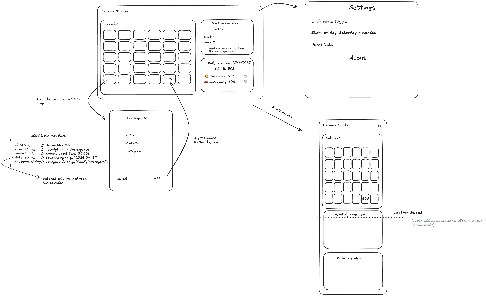

# Expense Tracker App

A simple, responsive expense tracking application built with Vue.js, designed to fulfill the requirements of a Junior Frontend Engineer take-home assignment.

## Description

This application allows users to log daily expenses, categorize them, and view summaries on a daily and monthly basis. It features an interactive calendar for date selection and persists all data locally in the browser using `localStorage`.

## Features

- **Log Expenses:** Add expenses with a name, amount, and category.

- **Persistent Storage:** Expense data is saved in `localStorage`, remaining available even after closing and reopening the browser.

- **Calendar View:** Navigate through months and select specific days to view or add expenses.

- **Daily Overview:** View a detailed list of expenses alongside the total amount spent for any selected day.

- **Monthly Overview:** View expense totals and summaries for the month currently displayed in the calendar.

- **Responsive Design:** Mobile-first layout that adapts to tablet and desktop screen sizes.

- **Basic Offline Support:** Functions correctly using locally stored data when offline.

## Tech Stack

- **Framework:** Vue.js 3 (Options API)

- **Build Tool:** Vite

- **Styling:** CSS

- **State Management:** Local component state and prop drilling (suitable for current scale)

- **Persistence:** Browser `localStorage` API

- **Linting/Formatting:** ESLint, Prettier (integrated via Vite starter)

## Access the application

here: https://arsentsn.github.io/expense-tracker-app/
or..

## Setup and Install (locally)

1. **Clone the repository:**

```bash

git clone https://github.com/arsentsn/expense-tracker-app.git

cd expense-tracker-app

```

2. **Install dependencies:**

```bash

npm install

```

3. **Run the development server:**

```bash

npm run dev

```

The application will be available at `http://localhost:5173` (or the next available port).

## Assignment Requirements

- Create an expense tracker that allows users to log and track their expenses throughout the day. The expenses can be bought items or any paid bills.

- Requirements:

- An “expense” item should at least have: name, amount (numeric value) and expense category (e.g., food, transport, bills, etc.)

- Data should persist on browser (maybe using localStorage or some other browser technology) even if the browser is closed and reopened

- Keep track records per day

- Check current total daily and monthly spend

- A responsive, mobile first, offline first, web app experience

- Check detailed report of expenses of a specific day

## My Approach

Given the flexibility in technology choice for this assignment and knowing that the company utilizes Vue.js, I saw this as the perfect opportunity to dive into the framework, which proved to be a great learning experience. I found the abundance of online resources, comprehensive documentation and Vue's intuitive and beginner-friendly structure, very helpful for getting started. I genuinely enjoyed the process of learning and building this application with Vue.

My development process involved several key stages:

1. **Planning & Design:** Before writing code, I brainstormed the core features and user flow. I then created visual wireframes using Excalidraw to map out the component structure and layout.


<sup>Click to view in detail</sup>

2. **Architecture:** I opted for a single-page application architecture centered around two main interactive components: `CalendarView` and `OverviewPanel`. This separation of concerns allows for focused functionality within each component and facilitates implementing a responsive, mobile-first design where these panels can adjust independently for different screen sizes. State management was handled locally within components and orchestrated by the main `App.vue` component using props and events.

3. **Development & Learning:** Development was an iterative process. I actively utilized the official Vue.js documentation, VueMastery tutorials, Reddit, Stack Overflow, and of course LLMs, to understand and implement core concepts, including the Options API, component communication patterns, lifecycle hooks, and integrating with `localStorage` for data persistence. This involved breaking down requirements into smaller tasks and tackling them systematically.

4. **Focus on Requirements:** Throughout development, I continuously referred back to the assignment requirements, ensuring features like daily/monthly tracking, data persistence, and responsiveness were addressed effectively. The focus was on delivering a complete and functional application first, aligning with the principle that timely shipping often trumps perfection, while still aiming for clean and understandable code.

This project served as a valuable hands-on learning experience with Vue.js, reinforcing my enthusiasm for frontend development and building user-centric applications.

## Design Choices & Trade-offs

- **Vue Options API:** Chosen for its clear and beginner friendly structure.

- **`localStorage`:** Used for data persistence as required by the assignment. It provides simple synchronous storage suitable for this client-side application. For larger datasets or more complex offline needs, IndexedDB or a backend solution would be considered.

- **State Management:** Core state (`expenses`, `selectedDate`, `calendarViewingDate`) is managed centrally in `App.vue` and passed down via props. Events are emitted upwards for state changes. This avoids the overhead of a dedicated state management library (like Pinia/Vuex) for an application of this size, but a library would be adopted for increased complexity.

- **Parent-Child Communication (`$refs`):** Used `$refs` for the specific case where `App.vue` needs to trigger a view reset (`switchToMonthlyView`) in the child `OverviewPanel.vue` upon month change. This provides a direct and efficient mechanism for this imperative action, though an event bus was considered as a more decoupled alternative.

- **CSS:** Implemented using plain CSS with CSS variables for theming potential and maintainability, following a mobile-first methodology.

## To-Do (If I Had More Time)

I had several additional features planned for this project, but due to time constraints—particularly while working full-time during the assignment—I wasn’t able to implement them all. Those include:

- Clean up CSS, mostly responsiveness media queries.
- fully implement css variables, with potentially adding theme support and dark mode

- Settings page with:
  -Dark mode switch
  -Theme picker
  -Start of week switch (Sunday / Monday)
  -reset localStorage data button
  -Currency picker

## Potential Future Improvements

- **Editing Expenses:** Add functionality to modify existing expense entries.

- **Data Visualization:** Enhance the Monthly Overview with charts (e.g., using Chart.js or ApexCharts) to visualize spending by category.

- **More Robust Offline:** Implement a full Progressive Web App (PWA) using a service worker for more reliable offline caching and installability.

- **Testing:** Expand unit and component test coverage using Vitest and Vue Test Utils.

- **Accessibility (A11y):** Conduct a more thorough accessibility audit and implement necessary ARIA attributes and keyboard navigation improvements.

- **UI changes:** Consider more advanced intuative interfaces with Daily, Weekly, Yearly, schedule views (similar to Google calendar).

- **User Authentication & Cloud Sync:** Add user accounts and sync data to a backend, or even supabase, for multi-device access.
